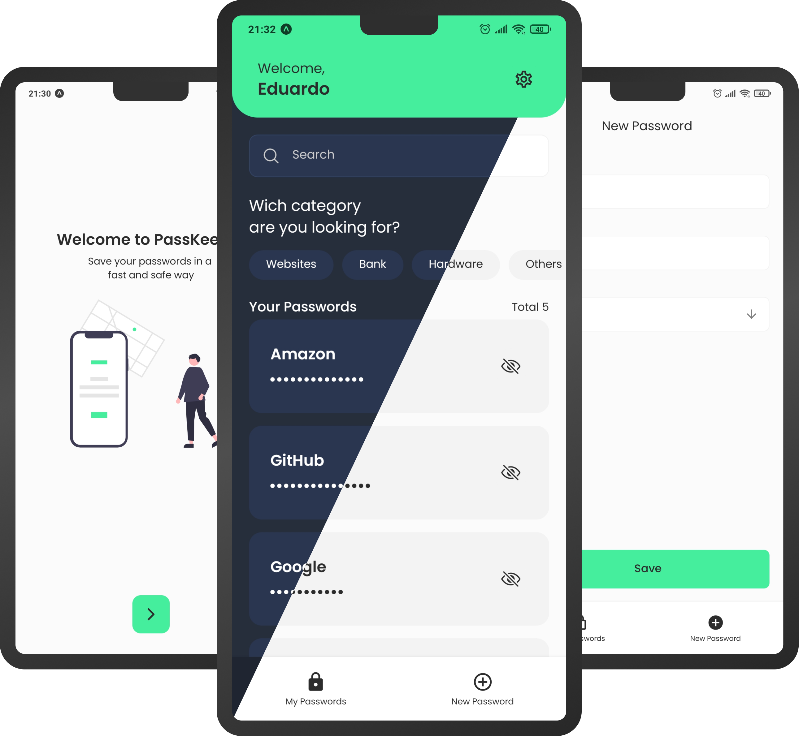

  

<h1 align="center">Keep your passwords safe</h1>

## About
This app was created to develop my React Native skills, the main challenge was to develop an app that I would use, so I decided to create PassKeeper. Its main goal is to manage your passwords in an easy and safe way.

### Security
To keep the user's data safe, all the registered passwords are encrypted by Expo's [SecureStore](https://docs.expo.dev/versions/latest/sdk/securestore/). The app only saves the user's password, to make them feel secure, because no e-mail or something similar is saved. No data is sent to the internet.

## Technologies
### React Native

### Expo

### Typescript

## Usage
This project is not avaible neither in the Play Store and App Store. You can download the projects APK [here](https://drive.google.com/file/d/1_d-iDDwsrTRqv_7BlbGAlBn9PgZI2qb5/view?usp=sharing).

In case you want to run the project locally you'll have to follow these steps:

1 - Install Expo by following this [tutorial](https://docs.expo.dev/get-started/installation/) (only if you don't have it already)

2 - Clone the project with `https://github.com/Eduardo-H/passkeeper.git`

3 - Install all the project's dependencies by running `yarn` or `npm install`

4 - Run the project with `expo start`